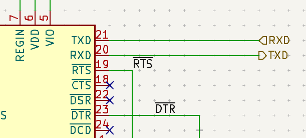
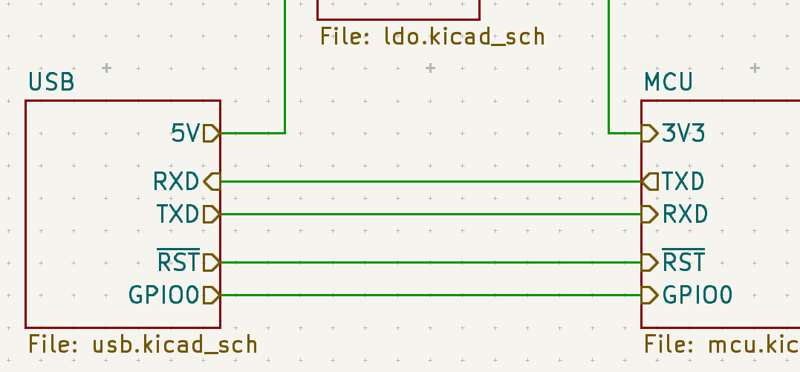
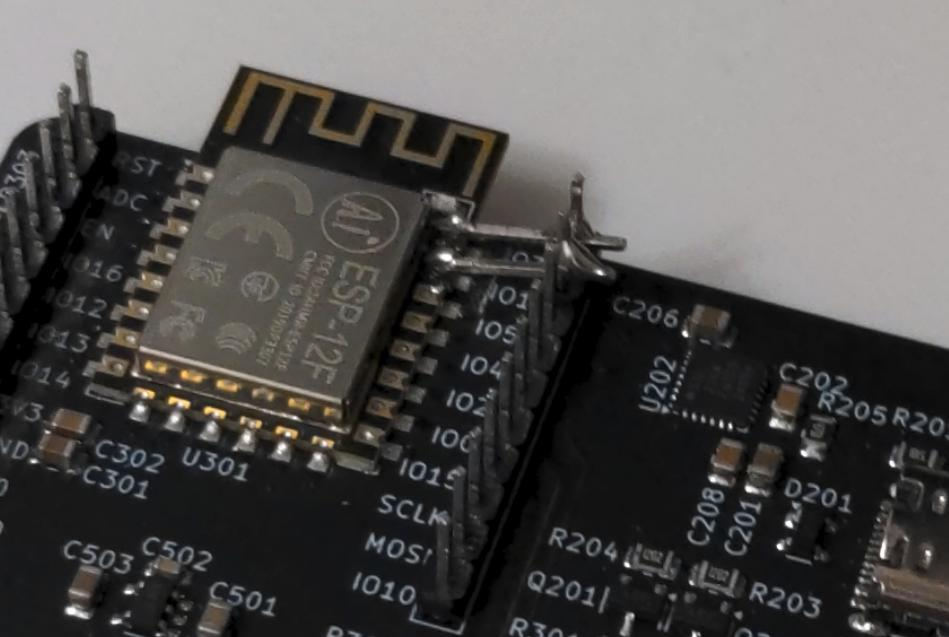
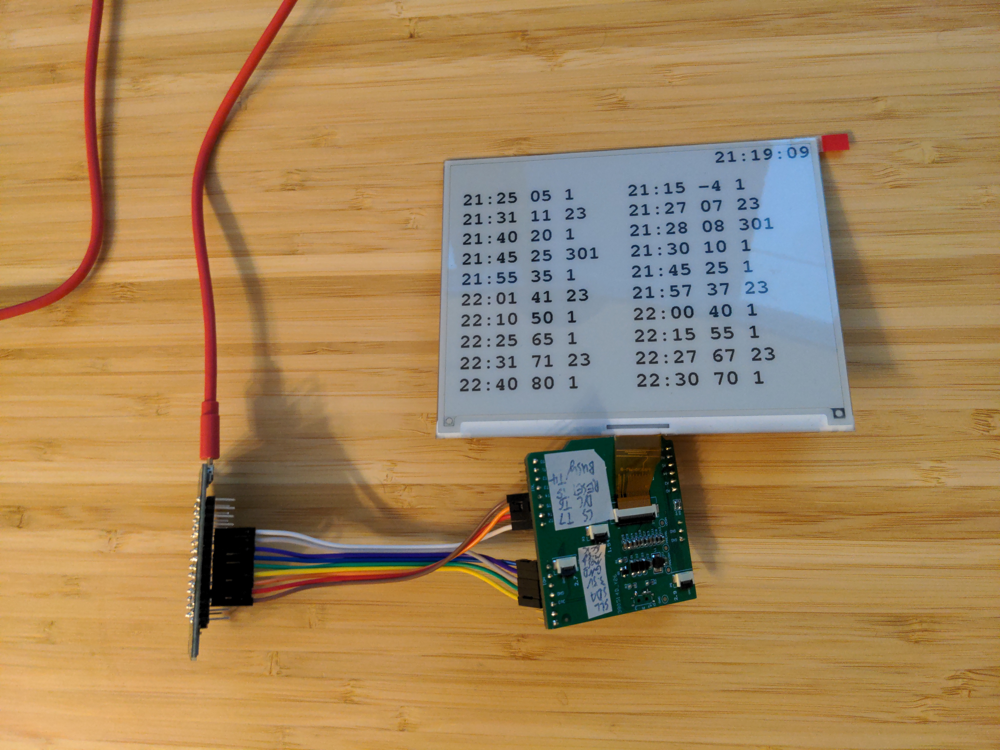
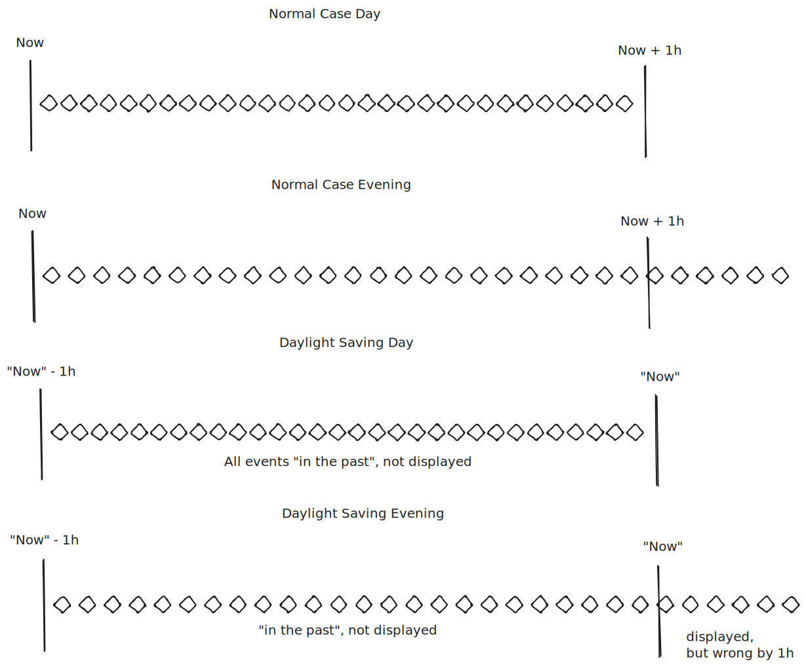
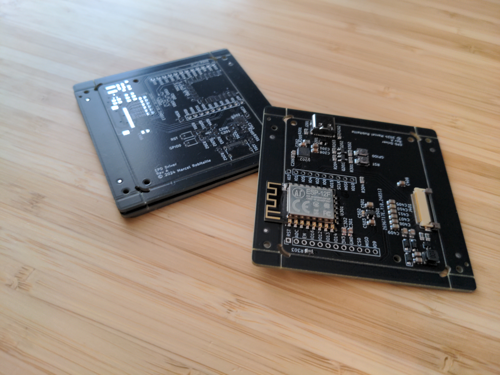
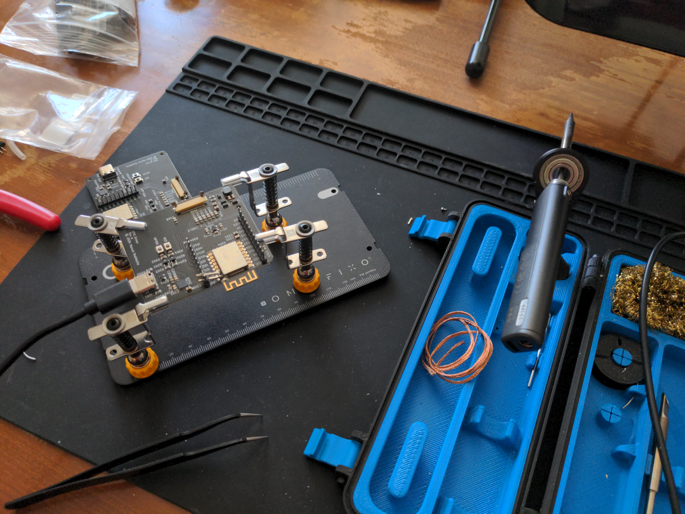
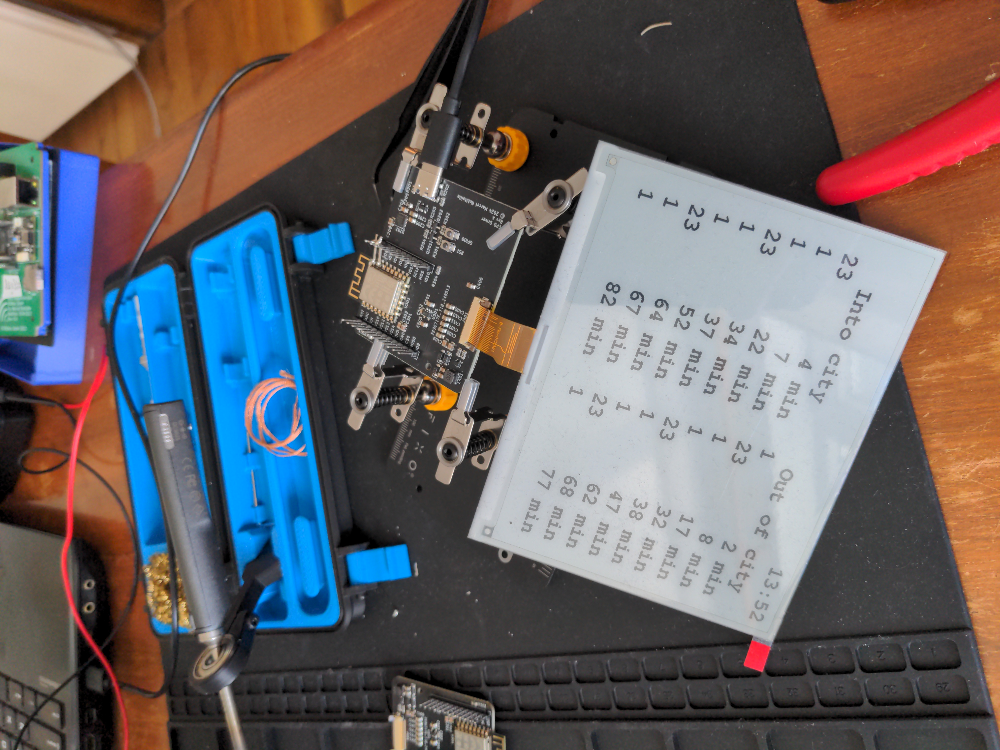
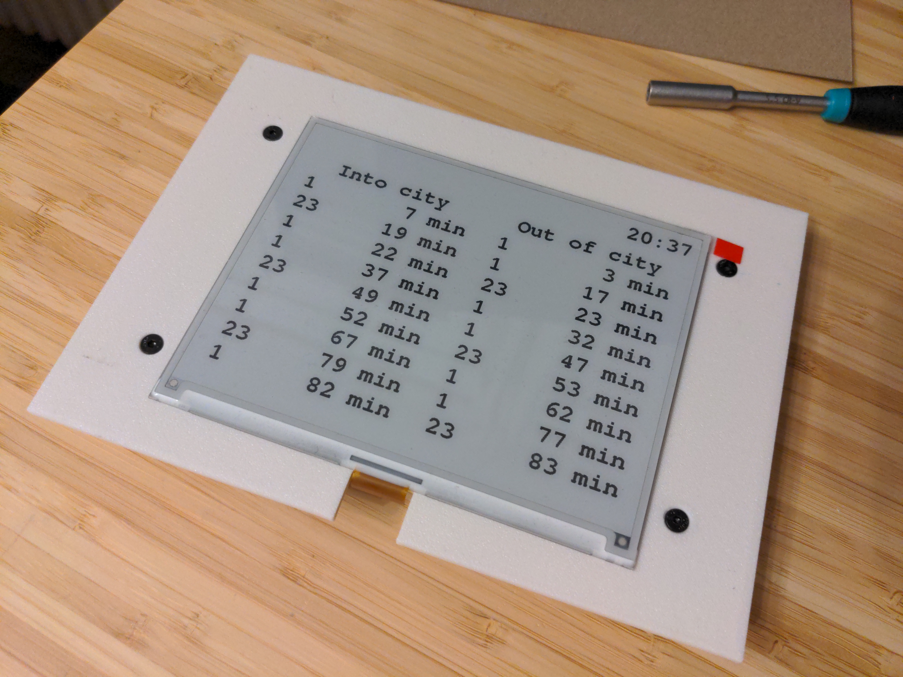
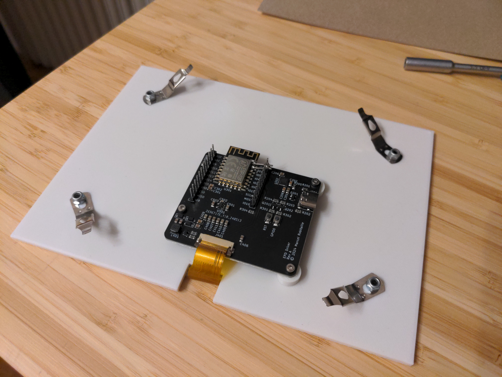

+++
title = "You'd Better Run!"
date = 2024-12-17
[extra]
header_image = "/youdbetterrun/image.jpg"
[taxonomies]
tags= ["e-paper", "PCB", "reverse-engineering", "hacking", "programming", "C++"]
+++

Do you have time to walk leisurely to the bus stop to catch your bus, or should you run?
This project is an e-paper screen that hangs on the wall by the door
so that you can see at a glance how long you have to catch your bus.
This blog post is not a tutorial.
There is [a dedicated GitHub project for that](https://github.com/youdbetterrun).
Instead, this post discusses some interesting anecdotes and some funny moments during development.

<!-- more -->

## UART

This project uses an ESP8266, which is a microcontroller that is programmed over UART.
UART is a communication interface able to send data between two devices using two wires:
one that transmits (TX) and one that receives data (RX).
Everybody with a few projects under their belt knows that you have to connect
the transmit signal from one device to the receive signal of the other.
This makes sense, but is easily forgotten and is a common trap for beginners.
I would never make such a silly mistake of course.
You can clearly see in the image below that I connected `RXD` to `TXD` and `TXD` to `RXD`.


In fact, I've internalized this lesson so much that I switched the signals twice just to be sure!



In case it isn't obvious, this puts back `RXD` to `RXD` and `TXD` to `TXD`, which doesn't work at all.
Always thoroughly review your PCB before ordering!
Otherwise, you will end up with cut trace and bodge connections like this.


The root of the problem is that the naming depends on your perspective.
Even if you know you have to cross the signals,
it's not always clear how things are labelled or where the perspective should change.
There were obviously at least two places that seemed reasonable to me for the perspective to change.

This is why I really like SPI's naming: "Controller In, Peripheral Out" (CIPO) and "Controller, Out Peripheral In" (COPI).
As long as you know which device is the controller and which are the peripherals (which is *usually* obvious),
the naming is clear and does not depend on perspective.
Unfortunately, SPI's naming has problems of its own, having undergone [a renaming for political correctness](https://hackaday.com/2020/06/29/updating-the-language-of-spi-pin-labels-to-remove-casual-references-to-slavery/).
I don't disagree with this, but I can see how it could be confusing for newcomers since the old naming is still common.

## Why is the screen suddenly blank??

Before the PCB was designed,
this project lived as a prototype made out of the screen, a NodeMCU, and a [Good Display ESP32-T01 adapter board](https://www.good-display.com/product/524.html).


I used this prototype for many months, and it worked very well.
Then, one day, I was heading to work and the screen was completely blank (except for the time).
I was annoyed, and left for work without knowing how much time I had to catch the bus.
This went on for a few days.
I eventually had some time in the evening to troubleshoot this, but the screen was populated.
I decided to try again when I had time and when the bug was active.
This opportunity never came.

It turns out that this day when the device suddenly broke was the first day of daylight saving time.


It also turns out that the API I use to get the data puts the bus stop events in UTC but puts the current time in local time
(in this embedded environment, it's easiest to use the API response for the current time).
In my prototype, I saw a discrepancy between the two, added a hard-coded offset, and moved on.

By why does this result in an empty screen in the morning and a populated screen in the evening?

The API also gives data for some events in the past.
I don't want to show these on the screen, so I filter them out.
This current time "springing forward" by one hour
effectively moves all stop events one hour into the past.

The API only gives a limited number of stop events (30).
During the day, buses come more frequently:
more than 30 within the next hour.
However, in the evening, buses come less frequently: fewer than 30 within the next hour.
In the morning, every event is seen as in the past because it falls within the deleted hour.
In the evening, not every event is in the past, so the screen is populated.
However, the events displayed on the screen actually arrive one hour later than displayed.



I solved this by using the Network Time Protocol to get the current time in UTC.

## Optimizing for low memory

The ESP8266 is a pretty old microcontroller with only 80 KiB of RAM.
These days, you'd be better off using an ESP32 or another more modern microcontroller,
but I used the ESP8266-based NodeMCU because I had it on hand.
As a result, I was not able to fit the entire JSON response from the API in RAM.

I first tried to tweak the request URL to request less data.
I changed some `1` to `0` in the URL trying to turn certain things off
(all the while checking that my Python proof-of-concept still worked)
without really knowing what the effect would be.
I got the size down a little bit, but I still couldn't fit the whole response in RAM.

Rather than collecting the entire response into a string,
I had to change to a streaming model.
I had to parse the JSON from the stream and keep only the data I needed.
Luckily, this is really easy in [ArduinoJson](https://arduinojson.org/),
the JSON library I used.

I first set up a filter. I assign `true` only to the data I want to keep (`[0]` applies to all elements in the array).
```c++
static StaticJsonDocument<200> filter;

filter["serverInfo"]["serverTime"] = true;
filter["stopEvents"][0]["departureTimePlanned"] = true;
filter["stopEvents"][0]["departureTimeEstimated"] = true;
filter["stopEvents"][0]["transportation"]["number"] = true;
filter["stopEvents"][0]["location"]["properties"]["platform"] = true;
```

Then, I get the stream of the HTTP response and give it to `ArduinoJson` together with the filter.
```c++
DynamicJsonDocument doc(6'000);
DeserializationError error = deserializeJson(doc, http.getStream(),
		DeserializationOption::Filter(filter));
```

The result is an object with only the data I need small enough to fit in my RAM. I can query it like this:
```c++
String serverTime = doc["serverInfo"]["serverTime"];
nowLocal = DateTime(serverTime.c_str());
```

## Additional Images






